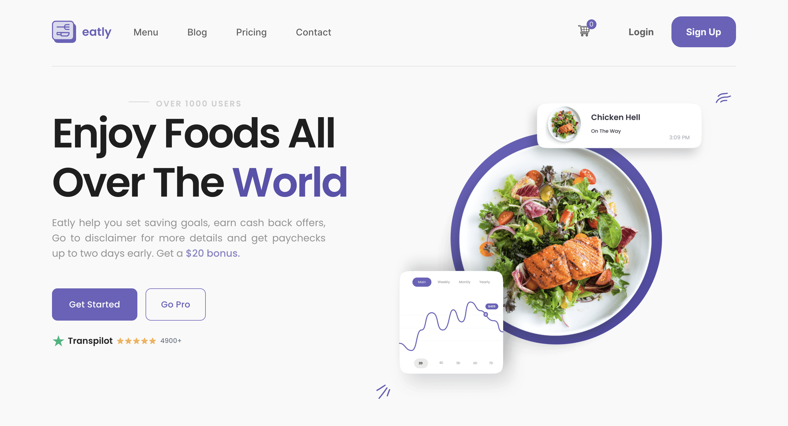

# Eatly Grocery Store

# Overview

Eatly is an online grocery store platform designed to provide users with an easy and convenient shopping experience. 
The platform features a wide range of products, user-friendly navigation, and a seamless checkout process.

# Features

- **User-Friendly Interface**: Easy navigation and product search.
- **Wide Range of Products**: Extensive selection of groceries.
- **Seamless Checkout**: Smooth and secure payment process.
- **Responsive Design**: Accessible on both desktop and mobile devices.

# Technologies Used

- **Front-end**: HTML, CSS, JavaScript
- **Additional**: Swiper, Jquery, Mockapi, Google Maps, Accordion-js
- **Bundler**: Vite

# What was done

I implemented features such as adding products to the cart and local storage, deleting items, adding to favorites, searching 
for products by name or filter, sliders using Swiper, and an accordion. When the "To order" button is clicked, users are redirected 
to the order process, where they enter their data and are shown the route to the nearest store on the map in real time, along with 
the delivery time. If the delivery time exceeds one hour, we do not deliver there. Additionally, I created a blog that makes server 
requests to receive articles and displays them in parts. The site also includes registration and login with validation using the jQuery 
library and sends data to the server. It may be somewhat primitive, but I am still learning.
